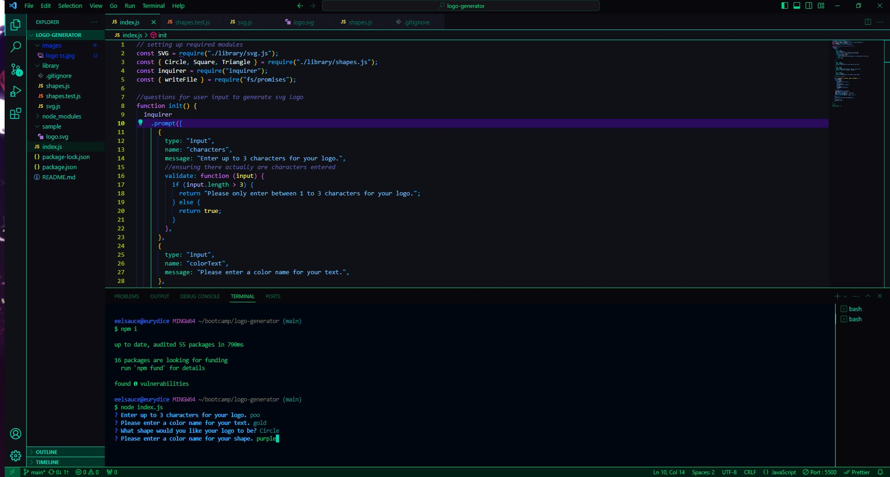
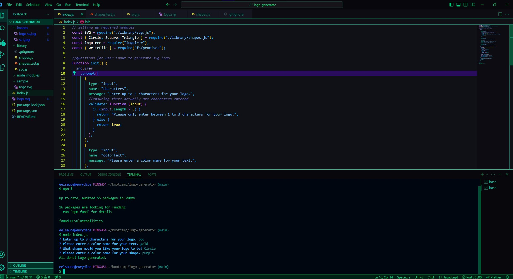

# Logo Generator

---

## Contents

1. [Description](#description)
2. [Usage](#usage)
3. [License](#license)
4. [Contribution](#contribution)
5. [Credits](#credits)
6. [Images](#images)

---

## Description

    This application is an easy to use and highly efficient way of creating a logo in virtually no time flat. Coming into this was a fun challenge and I got to learn a lot even outside of a course setting from a vast amount of resources. Creating this command line application brings a lot of new and learned skills to the table and I enjoyed getting to test myself. This application will make it as easy as a few selections to create a logo for anything the user may need it for.

---

## Usage

    To use this application, you must open it in Visual Studio Code and open the integrated terminal in the folder correlating to the application needing to be run. From there, be sure you have all packages installed by typing `npm i`. Once complete, type `node index.js` and it will populate questions, letting you, the user, create a logo from three different shape options and a muiltitude of colors for both the text and the logo. When the program has completed its run, a new svg file should populate in the logo-generator folder. Open that file in a browser and voila! You have created your own logo.

---

## License

    License used for this project - MIT License
    * For more information on license types, please reference this website
    for additional licensing information - [https://choosealicense.com/](https://choosealicense.com/).

---

## Contribution:

    To contribute to this application, create a pull request.
    Here are the steps needed for doing that:
    - Fork the repo
    - Create a feature branch (git checkout -b NAME-HERE)
    - Commit your new feature (git commit -m 'Add some feature')
    - Push your branch (git push)
    - Create a new Pull Request

    Following a code review, your feature will be merged.

---

## Credits:

    I wouldn't have been able to successfully complete this without the help of my UTA Bootcamp instructors and TAs, StackOverflow and Codepen.

Additionally, here is a link to a video where I walk through using this application:
https://drive.google.com/file/d/1Z-VRR7JuQJaouhGb8uwB3CI2fjAApyDn/view?usp=share_link

---

## Images:

---

## Contact:

- GitHub Username: [conquerersHaki](https://github.com/conquerersHaki)
